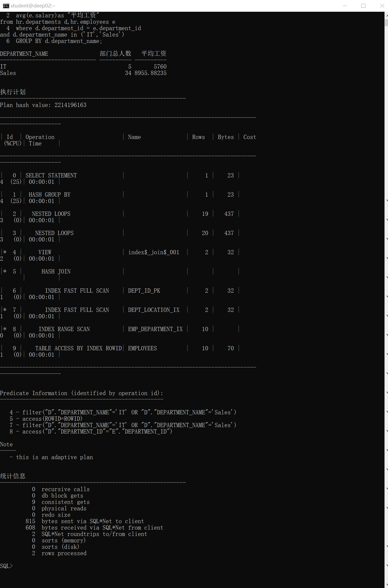
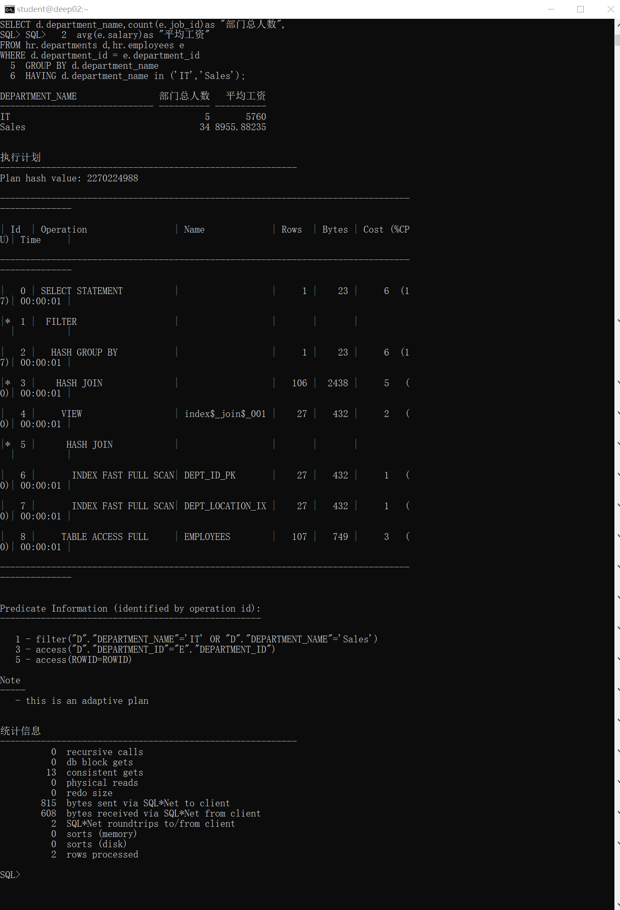
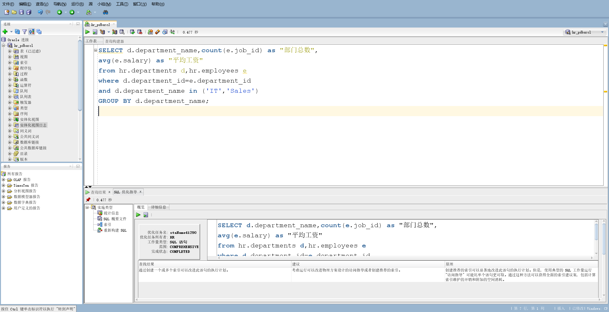
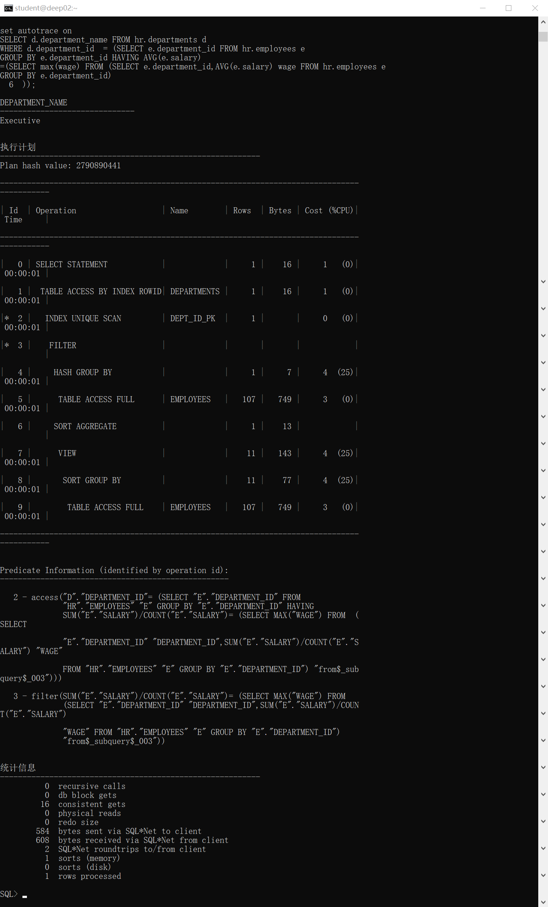
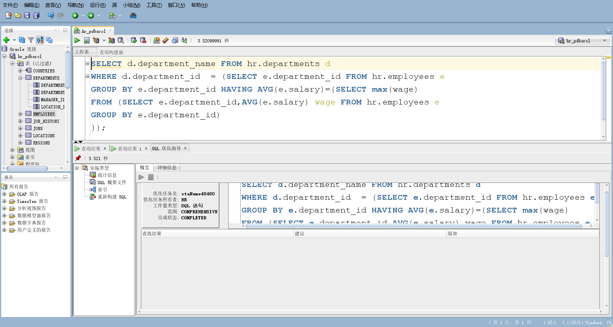

## 实验1：SQL语句的执行计划分析与优化指导 
### 实验目的

分析SQL执行计划，执行SQL语句的优化指导。理解分析SQL语句的执行计划的重要作用。

### 实验内容

- 对Oracle12c中的HR人力资源管理系统中的表进行查询与分析。
- 首先运行和分析教材中的样例：本训练任务目的是查询两个部门('IT'和'Sales')的部门总人数和平均工资，以下两个查询的结果是一样的。但效率不相同。
- 设计自己的查询语句，并作相应的分析，查询语句不能太简单。

### 教材中的查询语句

查询1:

```sql
set autotrace on

SELECT d.department_name,count(e.job_id)as "部门总人数",
avg(e.salary)as "平均工资"
from hr.departments d,hr.employees e
where d.department_id = e.department_id
and d.department_name in ('IT','Sales')
GROUP BY d.department_name;
```

运行结果：



分析:
运行结果表示consistent gets=9、physical reads=0
查询2:

```sql
set autotrace on

SELECT d.department_name,count(e.job_id)as "部门总人数",
avg(e.salary)as "平均工资"
FROM hr.departments d,hr.employees e
WHERE d.department_id = e.department_id
GROUP BY d.department_name
HAVING d.department_name in ('IT','Sales');
```

运行结果:



分析:
运行结果表示consistent gets=13、physical reads=0

##### 比较分析结果 

根据分析结果综合分析，同样的输出结果,因为查询2的consistent gets大于查询1,我认为最优的语句为:查询1看,将其放入sqldeveloper的优化指导工具进行优化指导,给出的建议如图:


### 设计查询语句

查询平均工资最高的部门名称

``` sql
SELECT d.department_name FROM hr.departments d
WHERE d.department_id  = (SELECT e.department_id FROM hr.employees e 
GROUP BY e.department_id HAVING AVG(e.salary)
=(SELECT max(wage) FROM (SELECT e.department_id,AVG(e.salary) wage FROM hr.employees e 
GROUP BY e.department_id)
))

```

运行结果:


分析:
运行结果表示consistent gets=16、physical reads=0

查询指导优化:


##### hr没有默认执行权限

使用system登录到数据库，然后"GRANT plustrace to hr"

### 实验总结
通过本次实验学到了如何分析对于同一个查询结果的不同SQL语句的好坏。主要是通过consistent gets、physical reads这两个信息,有时候还要综合其他信息比较