## 一、用户与权限管理

### （1）表空间的创建

  ***\*创建在\*******\*D、E盘，分别赋予D盘300M，E盘200M的表空间\****

***\*SQL> create tablespace MYTBS logging datafile 'D:\MYTBS1.DBF' size 300m;\****

***\*SQL> alter tablespace MYTBS add datafile 'E:\MYTBS2.DBF' size 200m;\****

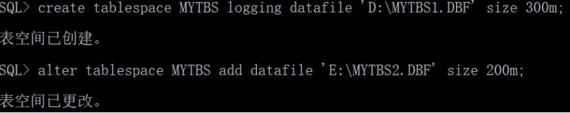 

 

### （2）用户***\*配置\****文件的创建

 ***\*SQL> create profile userprofile limit\****

 ***\*2  password_life_time 10\****

 ***\*3  failed_login_attempts 3\****

 ***\*4  password_lock_time 1;\****

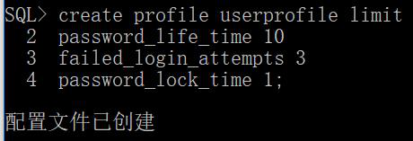 

 ***\*从\****dba_profiles数据字典表查看该配置文件中的资源配置结果

SQL> select * from dba_profiles where profile='USERPROFILE';

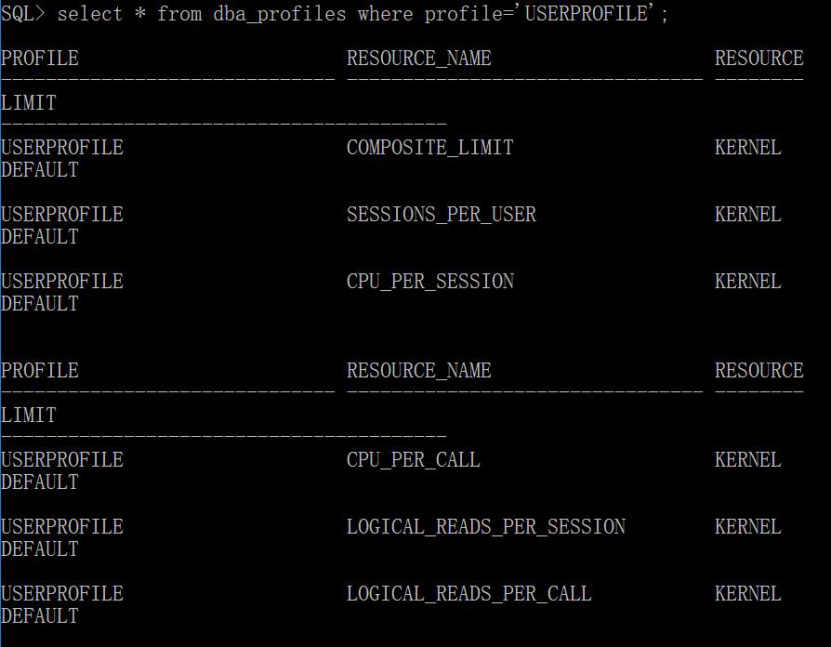 

### （3）用户的创建

 ***\*新建一个用户gw，并设置默认表空间为MYTBS\****

SQL> create user gw identified by 1615925218 default tablespace MYTBS; 

 

 用户gw的配置文件为userprofile

SQL> alter user gw profile USERPROFILE;

 

 从dba_users数据字典表，查看新建的用户gw的默认表空间

SQL> select username,account_status,lock_date,expiry_date

 2  from dba_users

 3  where username='GW';

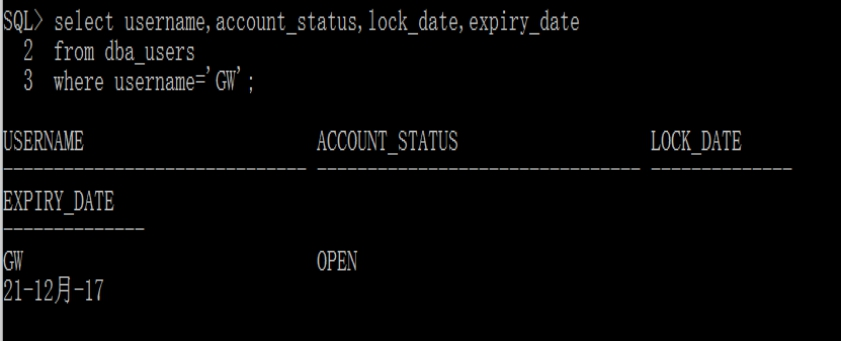 

### （4）权限的分配

为用户gw赋予登录Oracle的权限，赋予创建任何表、创建任何索引的权限，将DBA的角色给新建用户；查看对应的用户获得的权限和角色用数据字典表user_sys_privs,user_tab_privs,user_role_等

  SQL> grant connect,resource to gw;

SQL> grant create any table,create any index to gw;

SQL> grant dba to gw;

SQL> conn gw/1615925218;

SQL> select * from user_sys_privs;

SQL> select * from user_tab_privs;

SQL> select * from user_role_privs;

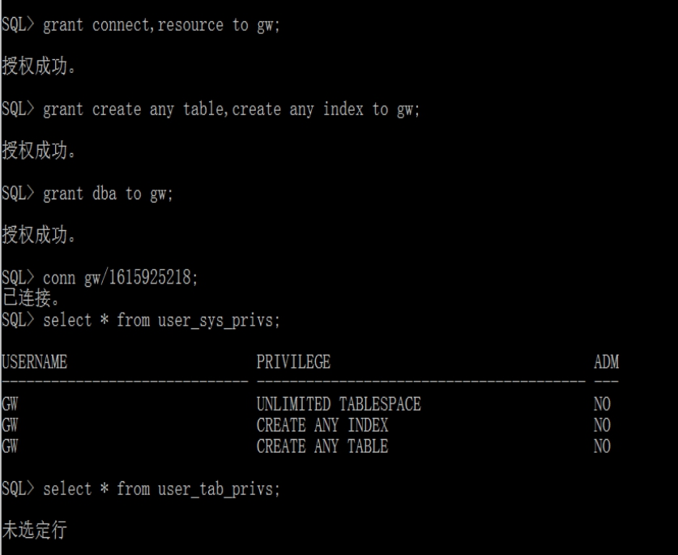 

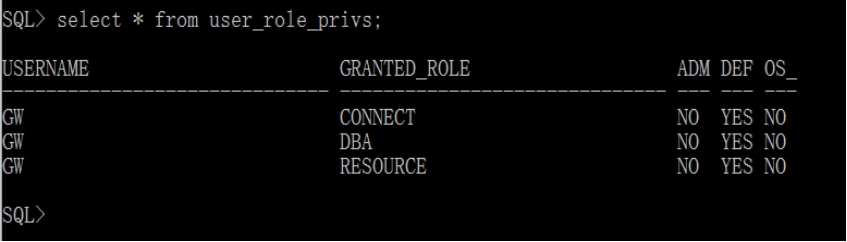 

### （5）用户登录

执行show user命令，显示当前登录用户

   SQL> show user;

   

## 二、Oracle对象的创建和管理

### ***\*1、需求分析\****

该系统目标就是为物流业提供方便快捷管理方式。主要设计：建立业务信息，货物信息，卖家信息，消费者信息；完成业务信息，货物信息，卖家信息，消费者信息；业务实体包括操作员，发货城市，发货站，费用，接洽时间，收货站，收货城市，一个收货人要网购一种货物，一个货物有标签，名称，体积，重量，包装类型。货物有发货人统一发送，发货人包括姓名，省份证号码，点话，地址。

### ***\*2、数据库设计\****  

####  **(1)****、****功能模块图**

  

 

 

 

####  **(2)****、概念设计**

  卖家与业务员洽谈物流的发货时间和地点，收货时间和地点，然后业务员保存该订单信息（货物ID号，消费者ID号，费用），随后发送货物。

####  **(3)****、****逻辑结构设计**

卖家信息（卖家ID号，姓名，年龄，点话，住址）；

货物信息（货物ID号，货物名，体积，重量，包装类型）；

消费者信息（消费者ID号，姓名，年龄，点话，住址）；

业务信息（业务员ID号，洽谈时间，发货站，发货城市，收货站，收货城市）；

选择信息（业务ID号，业务员ID号，消费者ID号，货物ID号，费用）；

运输信息（运输ID号，卖家ID号，货物ID号，发货时间）； 

####  **(****4****)、****创建表的代码实现**

##### 1)创建卖家信息表gw_Seller(sno卖家ID号，sname姓名，sage年龄，stel电话，saddress住址)sno设为主键

  ***\*SQL> create table gw_Seller(\****

 ***\*2  sno varchar(20) not null primary key,\****

 ***\*3  sname varchar(20) not null,\****

 ***\*4  sage varchar(20) not null,\****

 ***\*5  stel varchar(20) not null,\****

 ***\*6  saddress varchar(20) not null);\****

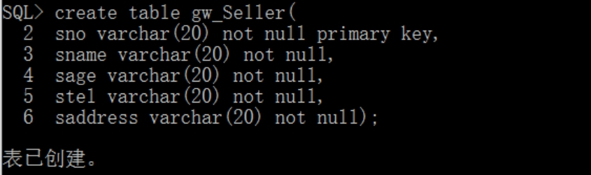 

##### 2)创建货物信息表gw_Goods(gno货物ID号,gname货物名,volume体积,weight重量,pack货物类型) gno设置为主键

 SQL> create table gw_Goods(

 2  gno char(10) primary key,

 3  gname char(10) not null,

 4  volume char(10),

 5  weight char(10),

 6  pack char(10));

 

##### 3)创建消费者信息表gw_Consume(cno消费者ID号，cname姓名,cage年龄,ctel点话,caddress住址) cno为主键

 ***\*SQL> create table gw_Consume(\****

 ***\*2  cno char(10) primary key,\****

 ***\*3  cname char(10) not null,\****

 ***\*4  cage char(10) not null,\****

 ***\*5  ctel char(10) not null,\****

 ***\*6  caddress char(10) not null);\****

 

##### 4)创建业务信息表gw_Business(bno业务员ID号btime洽谈时间,fhz发货站,fhcity发货城市,shz收货站,shcity收货城市)bno为主键

 ***\*SQL> create table gw_Business(\****

 ***\*2  bno char(10) primary key,\****

 ***\*3  btime char(10) not null,\****

 ***\*4  fhz char(10) not null,\****

 ***\*5  fhcity char(10) not null,\****

 ***\*6  shz char(10) not null,\****

 ***\*7  shcity char(10) not null);\****

 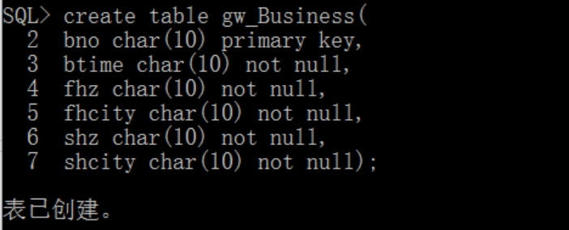

##### 5)创建选择信息表gw_Select(seno业务ID号, bno业务员ID号, cno消费者ID号, gno货物ID号,cost费用)seno为主键，bno,cno,gno为外键

 ***\*SQL> create table gw_Select(\****

 ***\*2  seno char(10),\****

 ***\*3  bno char(10),\****

 ***\*4  cno char(10),\****

 ***\*5  gno char(10),\****

 ***\*6  cost char(10),\****

 ***\*7  primary key(seno,bno,cno,gno),\****

 ***\*8  foreign key(bno) references gw_Business(bno),\****

 ***\*9  foreign key(cno) references gw_Consume(cno),\****

 ***\*10  foreign key(gno) references gw_Goods(gno));\****

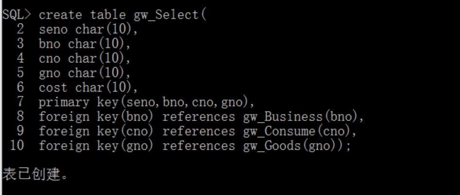 

 

##### 6)创建运输信息表gw_Transport(tno运输ID号, sno卖家ID号, gno货物ID号,ftime发货时间)tno为主键，sno,gno为外键

  ***\*SQL> create table gw_Transport(\****

 ***\*2  tno char(10) primary key,\****

 ***\*3  sno varchar(20),\****

 ***\*4  gno char(10),\****

 ***\*5  ftime char(10) not null,\****

 ***\*6  foreign key(sno) references gw_Seller(sno),\****

 ***\*7  foreign key(gno) references gw_Goods(gno));\****

  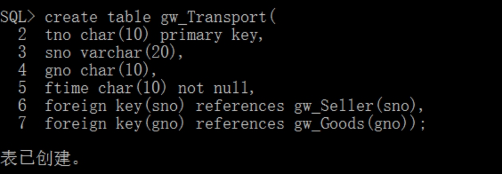

####  **(****5****)、创建索引、视图**

 1)创建索引

上面几个表创建的同时设置的有主键，创建主键的时候会创建同名索引，所以为运输信息表的发货时间创建索引。

SQL> create index sy1 on gw_Transport(ftime);

 

 2)创建视图

1、SQL> create view st1 as select stel,saddress from gw_Seller where sname='Mark';

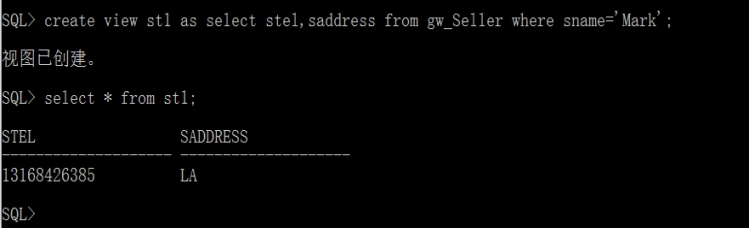 

 2、SQL> create view st2(sno,sname,gno) as

 2  select gw_Seller.sno,gw_Seller.sname,gw_Transport.gno

 3  from gw_Seller,gw_Transport

 4  where gw_Seller.sno=gw_Transport.sno;

 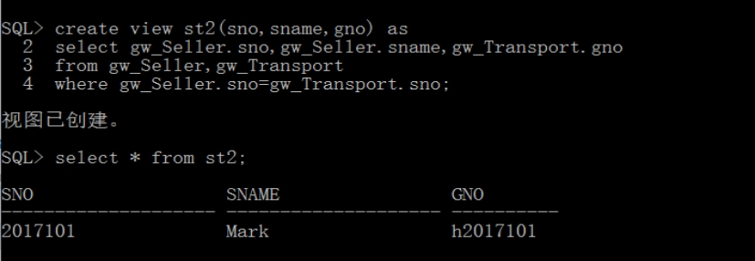

 

 3、SQL> create view st3(bno,fhcity,seno,cost)

 2  as

 3  select gw_Business.bno,gw_Business.fhcity,gw_Select.seno,gw_Select.cost

 4  from gw_Business,gw_Select

 5  where gw_Business.bno=gw_Select.bno;

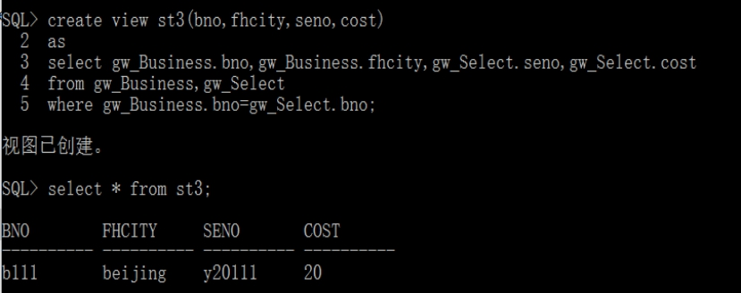 

 

## 三、PL/SQL编程

### ***\*1、步骤分析\****

  首先写一个程序包Trans_package，内部通过函数、游标、存储过程来完成一些功能。其返回结果均是变量，通过调用均可获得一个变量来进行前台需求操作。

1) 业务员登录函数teacher_login，本函数输入业务员身份：账号、密码，返回一个数字0，-1或1，分别表示没有该用户，登录失败和登录成功。

2) 业务员与卖家洽谈，记录谈话时间，以及谈话内容（发货站，发货城市，收货站，收货城市），生成业务员工作信息。

3) 业务员提交订单。业务员将卖家给的买家和货物信息进行提交到订单系统，生成费用及订单，订单系统接收订单，准备发货。

4) 写一个触发器create_order。每提交一次订单，系统就会进行一次记录，确保每个订单已经得到确认。万无一失。

### ***\*2、程序包的规范\****

 ***\*SQL> create or replace package Trans_package is\****

 ***\*2  function Trans_login(account varchar2,password varchar2) return number;\****

***\*/\*******\**\*******\*业务员登录\*\*******\*/\****

 ***\*3  procedure Trans_business(v_bno varchar2,v_btime varchar2,v_fhz varchar2,\****

 ***\*4  v_fhcity varchar2,v_shz varchar2,v_shcity varchar2);\****

***\*/\*******\**\*******\*业务员工作记录\*\*******\*/\****

 ***\*5  procedure Trans_order(v_seno varchar2,v_bno varchar2,v_cno varchar2,\****

 ***\*6  v_gno varchar2,v_cost varchar2);\****

***\*/\*******\**\*******\*提交订单\*\*******\*/\****

 ***\*7  end Trans_package;\****

 ***\*8  /\****

### ***\*3\*******\*、\*******\*程序包的主体\****

 ***\*SQL> create or replace package body Trans_package is\****

 ***\*2  function Trans_login(account varchar2,password varchar2) return number is\****

 ***\*3  num_ret number;\****

 ***\*4  v_pwd gw_manager.v_password%type;\****

 ***\*5  begin\****

 ***\*6  select v_password into v_pwd from gw_manager where account=v_id;\****

 ***\*7  if v_pwd=password then\****

 ***\*8  num_ret:=1;\****

 ***\*9  else\****

 ***\*10  num_ret:=-1;\****

 ***\*11  end if;\****

 ***\*12  return num_ret;\****

 ***\*13  exception\****

 ***\*14  when no_data_found then\****

 ***\*15  num_ret:=0;\****

 ***\*16  return num_ret;\****

 ***\*17  end Trans_login;\****

 ***\*18\****

 ***\*19  procedure Trans_business(v_bno varchar2,v_btime varchar2,v_fhz varchar2,\****

 ***\*20  v_fhcity varchar2,v_shz varchar2,v_shcity varchar2) is\****

 ***\*21  begin\****

 ***\*22  insert into gw_Business values(v_bno,v_btime,v_fhz,v_fhcity,v_shz,v_shcity);\****

 ***\*23  end Trans_business;\****

 ***\*24\****

 ***\*25  procedure Trans_order(v_seno varchar2,v_bno varchar2,v_cno varchar2,\****

 ***\*26  v_gno varchar2,v_cost varchar2) is\****

 ***\*27  begin\****

 ***\*28  insert into gw_Select values(v_seno,v_bno,v_cno,v_gno,v_cost);\****

 ***\*29  end Trans_order;\****

 ***\*30  end Trans_package;\****

 ***\*31  /\****

 

***\*触发器\****

***\*SQL> create or replace trigger create_order\****

 ***\*2  before insert\****

 ***\*3  on gw_Select\****

 ***\*4  for each row\****

 ***\*5  declare\****

 ***\*6  var_tag varchar2(10);\****

 ***\*7  begin\****

 ***\*8  var_tag:='插入';\****

 ***\*9  insert into order_log\****

 ***\*10  values(var_tag,sysdate);\****

 ***\*11  end create_order;\****

 ***\*12  /\****

### ***\*4\*******\*、测试\****

先插入一些数据。

***\*SQL> insert into gw_manager values('qwe','123');\****

***\*SQL> insert into gw_\*******\*Go\*******\*ods values('h2017101','Apple',’3’,’6kg’,’\*******\*精装\*******\*’);\****

***\*SQL> insert into gw_Consume values('g2017101','Tom',’23’,’1884535556’,’\*******\*N\*******\*ew York’);\****

 

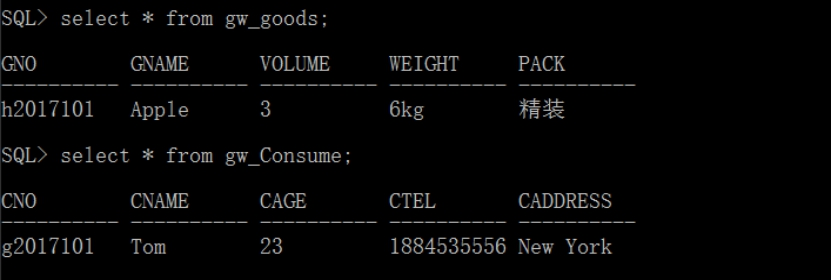 

1) 业务员登录

***\*SQL> set serveroutput on;\****

***\*SQL>exec dbms_output.put_line(Trans_package.Trans_login('qwe','123'));\****

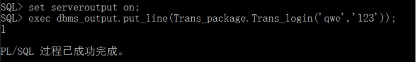 

2）业务员与卖家洽淡业务事项。

  ***\*SQL> declare\****

 ***\*2  out_word varchar2(20);\****

 ***\*3  begin\****

 ***\*4  Trans_package.Trans_business('123001','11:29','ZT1','上海','ZT3','郑州');\****

 ***\*5  out_word:='洽谈成功';\****

 ***\*6  dbms_output.put_line(out_word);\****

 ***\*7  end;\****

 ***\*8  /\****

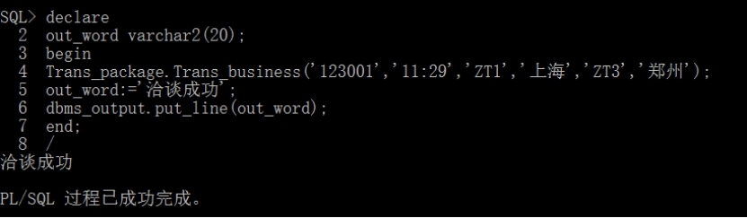 

***\*3\*******\*）\****业务员提交订单。

  ***\*SQL> declare\****

 ***\*2  out_word varchar2(20);\****

 ***\*3  begin\****

 ***\*4  Trans_package.Trans_order('z20171111','123001','g2017101','h2017101','13.67');\****

 ***\*5  out_word:='订单提交成功';\****

 ***\*6  dbms_output.put_line(out_word);\****

 ***\*7  end;\****

 ***\*8\**** ***\*、\*******\*/\****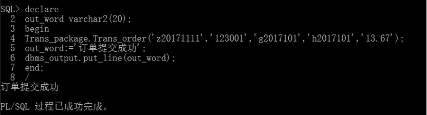

***\*4）触发器显示提示功能。\****

***\*SQL> select \* from order_log;\****

 

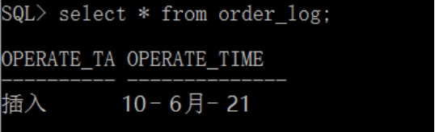 

 

## ***\*四、\*******\*Oracle备份\****

### ***\*1、设置归档模式\****

检查数据库是否处于归档模式

***\*SQL> archive log list;\****

结果不是就要改为归档，关闭运行的数据库实例

***\*SQL> shutdown immediate;\****

启动数据库实例到mount状态，但不要打开

***\*SQL> startup mount;\****

切换数据库日志模式

***\*SQL> alter database archivelog;\****

查看是否归档

***\*SQL> archive log list;\****

是的那就把数据库打开

***\*SQL> alter database open;\****

### ***\*2\*******\*、归档当前日志\****

显示归档日志信息

***\*SQL> select name,log_mode from v$database;\****

### ***\*3\*******\*、数据库完全备份及实现\****

(1)、设置MYTBS的两个表空间为备份模式。

***\*SQL> alter tablespace MYTBS begin backup;\****

 

(2)、查看处于备份模式的数据文件。

***\*SQL> select \* from v$backup;\****

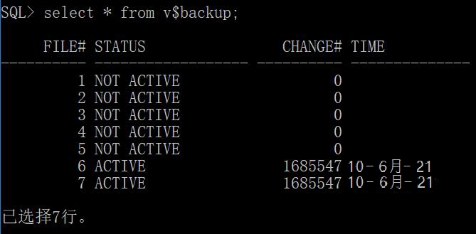 

(3)、使用命令热备份表空间的数据库文件。

***\*SQL> HOST COPY D:\MYTBS1.DBF D:\gw1\;\****

***\*SQL> HOST COPY E:\MYTBS2.DBF E:\gw2\;\****

 

(4)、将表空间设置为正常模式。

***\*SQL> Alter tablespace MYTBS end backup;\****

 

### ***\*4\*******\*、数据库完全恢复及实现\****

1、立即关闭数据库

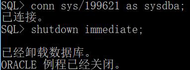 

2、将数据库启动到mount状态

***\*SQL> startup mount;\****

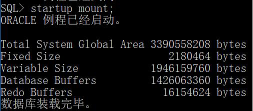 

3、将表空间的数据文件设置为脱机状态

***\*SQL> alter database datafile 'D:\MYTBS1.DBF' offline;\****

***\*SQL> alter database datafile 'E:\MYTBS2.DBF' offline;\****

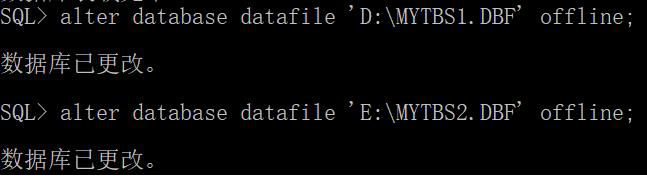 

4、打开数据库

***\*SQL> alter database open;\****

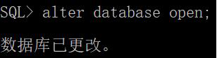 

5、将数据文件所在的表空间脱机

***\*SQL> alter tablespace MYTBS offline for recover;\****

 

6、用系统命令将备份的数据文件拷贝回去或者覆盖旧的数据文件所在的目录

***\*SQL> HOST COPY D:\MYTBS1.DBF D:\gw1\;\****

***\*SQL> HOST COPY E:\MYTBS2.DBF E:\gw2\;\****

 

7、执行表空间恢复命令

***\*SQL> recover tablespace MYTBS;\****

 

8、将表空间联机

***\*SQL> alter tablespace MYTBS online;\****

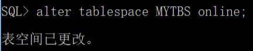 

 